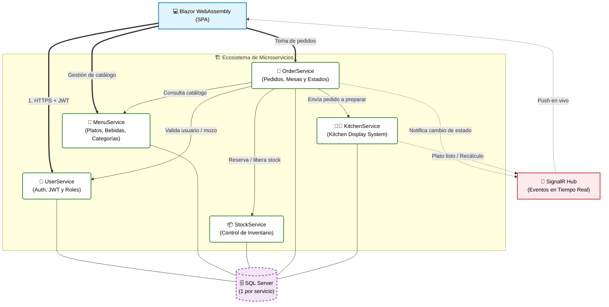

  <h1>🍽️ FastRestaurant</h1>
  <h3>Sistema de Gestión Inteligente para Restaurantes</h3>

  

    <b>Microservicios • Tiempo Real (SignalR) • Orquestación de Cocina</b>
  

  

    
    
  

---

## 💡 Sobre el Proyecto

**FastRestaurant** nace para resolver un problema muy concreto de los restaurantes medianos: la falta de sincronización entre el salón y la cocina durante las horas pico. Sin un sistema que ordene los tiempos de preparación, los mozos cargan comandas "a ciegas", los platos llegan fríos o desincronizados a la mesa, y cada noche de pico se convierte en una apuesta.

El desafío principal no fue solo digitalizar la toma de pedidos, sino diseñar un **motor de orquestación de tiempos** capaz de retrasar automáticamente los platos rápidos hasta que los lentos estén en la etapa correcta — y recalcular todo en tiempo real ante imprevistos (un plato arruinado, una cancelación) — sobre una arquitectura de **Microservicios en .NET 8** comunicados vía HTTP y eventos en tiempo real con **SignalR**.

### 🌟 Features Clave
* **Motor de Orquestación:** Sincroniza los tiempos de cocción para que toda la mesa reciba sus platos al mismo tiempo y a temperatura ideal.
* **Kitchen Display System (KDS):** Pantalla interactiva que agrupa y prioriza tareas de cocina por tiempo de preparación, no por orden de ingreso.
* **Recálculo en Tiempo Real:** Ante un plato arruinado o una cancelación, el sistema renotifica al mozo y recalcula la proyección de entrega al instante.
* **Roles y Permisos:** Accesos diferenciados para Gerente, Mozo y Cocinero, de extremo a extremo.
* **Estados en Tiempo Real:** Flujo `Recibido → En Preparación → Listo → Entregado` con alertas instantáneas vía WebSockets.

---

## 🏗️ Arquitectura del Sistema

Arquitectura de microservicios sobre **.NET 8** con **Clean Architecture** en cada servicio, cliente **Blazor WebAssembly** y comunicación en tiempo real vía **SignalR**.

---

## 📦 Repositorios

| Servicio | Descripción |
|---|---|
| [**Frontend**](https://github.com/FastRestaurant/Frontend) | Cliente Blazor WebAssembly (SPA) — interfaz para mozos, cocina y gerentes. |
| [**MicroservicioAuth**](https://github.com/FastRestaurant/MicroservicioAuth) | Autenticación, JWT y gestión de roles (Gerente, Mozo, Cocinero). |
| [**MicroservicioMenu**](https://github.com/FastRestaurant/MicroservicioMenu) | Catálogo de platos, bebidas y categorías. |
| [**MicroservicioStock**](https://github.com/FastRestaurant/MicroservicioStock) | Control de inventario e integración con el flujo de pedidos. |
| [**MicroservicioOrder**](https://github.com/FastRestaurant/MicroservicioOrder) | Gestión de pedidos, mesas y motor de orquestación de estados. |
| [**MicroservicioKitchen**](https://github.com/FastRestaurant/MicroservicioKitchen) | Kitchen Display System (KDS) — visualización y priorización de comandas. |

---

## 🛠️ Stack Tecnológico

 
   
   
   
   
   
   
   
   

---

## 👥 El Equipo — "SincroComanda"

Proyecto desarrollado por un equipo de **11 integrantes** bajo metodología **Scrum**, en **3 Sprints** de 2 semanas, con entregas demo desde el Sprint 1.

| Rol | Responsabilidad |
|---|---|
| Scrum Master | Facilita ceremonias y remueve obstáculos del equipo |
| Product Owner | Prioriza el backlog y valida criterios de aceptación |
| QA | Pruebas funcionales y control de calidad continuo |
| Developers (8) | Implementación distribuida por microservicio |
